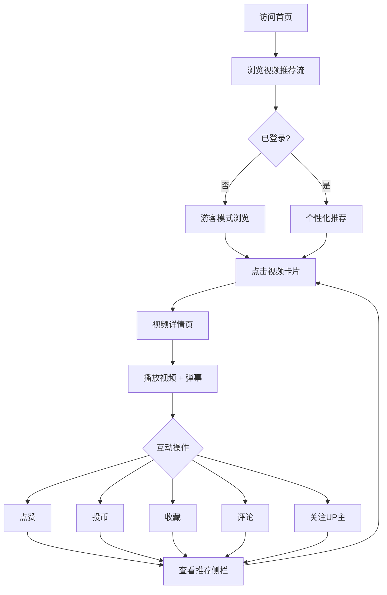
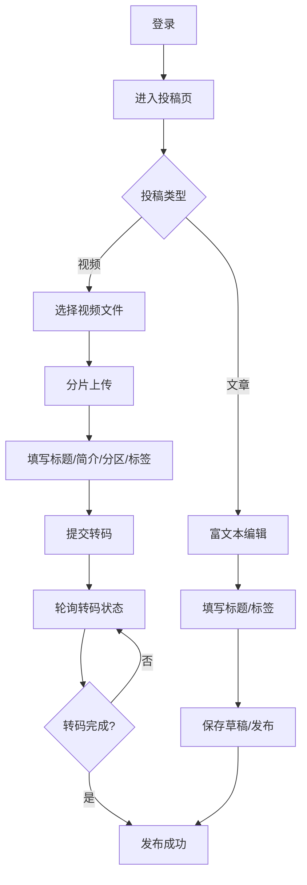
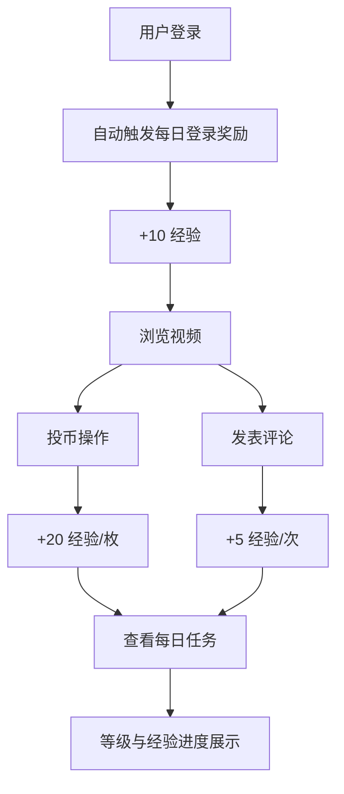

# 仿 B 站前端产品需求文档（PRD）

> 基于已完成后端 API（`server/docs/API.md`）构建的仿 B 站（哔哩哔哩）视频社区平台前端。

---

## 1. 产品概述

仿 B 站前端是一个视频社区平台 Web 应用，提供视频浏览、弹幕互动、多级评论、投稿（视频/文章/动态）等功能。面向喜欢视频内容创作与消费的年轻用户群体，目标是打造一个高互动性的内容社区。产品价值在于通过弹幕、评论、投币、收藏等丰富的互动机制，建立创作者与观众之间的情感连接。

- **技术栈**：Vue 3 + TypeScript + Vite + Pinia + Vue Router 4 + Tailwind CSS
- **后端**：已完成（Go + Gin + MySQL + Redis + RabbitMQ + Elasticsearch）
- **设计风格**：高度还原 B 站 UI（粉蓝主题 #FB7299 / #00AEEC，圆角卡片，顶部导航）

---

## 2. 核心功能

### 2.1 用户角色

| 角色 | 注册方式 | 核心权限 |
|------|---------|---------|
| 普通用户 | 邮箱注册 | 浏览、互动（点赞/评论/投币/收藏/关注）、投稿（视频/文章/动态）、个人中心管理 |
| 未登录访客 | 无需注册 | 浏览视频、查看评论、搜索（不可互动、不可投稿、不可访问个人中心） |

### 2.2 功能模块

1. **首页**：顶部导航栏、分区切换、视频推荐瀑布流、搜索入口、登录入口
2. **视频详情页**：视频播放器（含弹幕）、互动栏（点赞/投币/收藏/分享）、多级评论、推荐视频侧栏、UP 主信息卡
3. **搜索页**：搜索结果列表、搜索历史、热门搜索
4. **用户主页**：用户信息卡（粉丝/关注/等级）、视频列表、动态列表
5. **个人中心**：收藏夹管理、观看历史、通知消息、投币流水、每日任务、等级信息
6. **动态广场**：关注用户动态流、发布动态（图文）
7. **文章详情页**：文章内容渲染、评论区、文章互动
8. **投稿页**：视频上传（分片）、文章发布、草稿管理
9. **登录/注册页**：登录、注册、邮箱验证码、图形验证码

### 2.3 页面详情

| 页面名称 | 模块名称 | 功能描述 |
|---------|---------|---------|
| 首页 | 顶部导航栏 | Logo、搜索框、登录/头像入口、投稿入口、动态入口 |
| 首页 | 分区导航 | 横向分区标签切换（全部/动画/音乐/科技等），过滤视频流 |
| 首页 | 视频推荐流 | 瀑布流卡片网格，展示封面/标题/UP 主/播放量/弹幕数，无限滚动加载 |
| 视频详情页 | 视频播放器 | 自定义播放器，支持进度条/倍速/全屏，弹幕开关/发送 |
| 视频详情页 | 弹幕系统 | 实时弹幕 WebSocket 推送、弹幕渲染（滚动/顶部/底部）、弹幕颜色/字号 |
| 视频详情页 | 互动栏 | 点赞（❤️切换）、投币（1/2 枚弹窗）、收藏（收藏夹选择）、分享、关注 UP 主 |
| 视频详情页 | 评论区 | 多级评论树（顶级+回复）、点赞评论、发表评论、按热度/时间排序 |
| 视频详情页 | UP 主信息卡 | 头像/用户名/粉丝数、关注按钮、视频列表入口 |
| 视频详情页 | 推荐侧栏 | 相关视频列表，点击切换播放 |
| 搜索页 | 搜索结果 | 视频卡片列表，支持游标分页 |
| 搜索页 | 搜索历史 | 最近搜索关键词，点击直接搜索，支持删除/清空 |
| 用户主页 | 用户信息卡 | 头像/用户名/签名/粉丝数/关注数/经验等级 |
| 用户主页 | Tab 切换 | 视频 / 动态 两个标签页切换 |
| 用户主页 | 视频列表 | 用户发布的视频网格 |
| 用户主页 | 动态列表 | 用户发布的动态流 |
| 个人中心 | 侧边导航 | 收藏夹/历史/通知/投币流水/每日任务 标签切换 |
| 个人中心 | 收藏夹管理 | 收藏夹列表（创建/编辑/删除）、收藏夹内视频列表、移动收藏 |
| 个人中心 | 观看历史 | 视频观看历史列表、删除单条/清空、文章阅读历史 |
| 个人中心 | 通知消息 | 通知列表（点赞/评论/回复/关注）、未读数、标记已读、静默 |
| 个人中心 | 投币流水 | 硬币变动流水记录、按类型过滤 |
| 个人中心 | 每日任务 | 今日任务完成情况、登录奖励领取、等级与经验进度 |
| 动态广场 | 动态流 | 关注用户最新动态（图文）、点赞动态 |
| 动态广场 | 发布动态 | 标题/内容/图片（最多 9 张） |
| 文章详情页 | 文章内容 | 标题/作者/正文/标签、阅读量 |
| 文章详情页 | 评论区 | 多级评论、发表评论、点赞评论 |
| 投稿页 | 视频上传 | 分片上传视频文件、填写标题/简介/分区/标签、转码状态轮询 |
| 投稿页 | 文章发布 | 富文本编辑器、标题/内容/标签、草稿保存 |
| 登录/注册页 | 登录表单 | 邮箱+密码+图形验证码 |
| 登录/注册页 | 注册表单 | 邮箱+密码+邮箱验证码 |
| 登录/注册页 | 忘记密码 | 邮箱验证码重置 |

---

## 3. 核心流程

### 3.1 用户浏览与互动流程

用户打开首页 → 浏览视频推荐流 → 点击视频卡片进入详情页 → 播放视频（弹幕实时滚动）→ 点赞/投币/收藏（如未登录跳转登录页）→ 发表评论/回复 → 查看推荐侧栏继续浏览

### 3.2 用户投稿流程

用户登录 → 进入投稿页 → 选择投稿类型（视频/文章）→ 视频上传（分片上传→填写信息→等待转码→发布）或文章发布（编辑内容→保存草稿→发布）→ 投稿成功跳转内容页

### 3.3 每日任务流程

用户登录 → 自动触发每日登录奖励（+10 经验）→ 浏览视频（投币 +20/枚、评论 +5/次）→ 查看每日任务完成情况 → 经验值增长 → 等级提升

---

## 4. 用户界面设计

### 4.1 设计风格

**视觉风格**：高度还原 B 站设计语言，保持品牌一致性

- **主色**：#FB7299（B 站粉，用于 Logo/点赞/关注等强调元素）
- **辅色**：#00AEEC（B 站蓝，用于链接/标签/图标）
- **背景色**：#F4F5F7（浅灰，页面背景）
- **卡片背景**：#FFFFFF（白色，圆角卡片）
- **文字色**：#18191C（主文字）/ ##9499A0（次要文字）/ #61666D（辅助文字）

**按钮风格**：
- 主按钮：粉色背景 + 白色文字 + 圆角 6px
- 次按钮：白底 + 粉色边框 + 粉色文字
- 图标按钮：圆形/圆角，hover 变色

**字体**：
- 系统字体栈：`PingFang SC, Microsoft YaHei, -apple-system, BlinkMacSystemFont, "Segoe UI", Roboto, sans-serif`
- 标题：16-20px，font-weight 500-600
- 正文：14px，font-weight 400
- 辅助文字：12px，color #9499A0

**布局风格**：
- 桌面端优先，最大宽度 1280px 居中
- 顶部固定导航栏（高度 56px）
- 视频卡片网格：4 列（大屏）/ 3 列（中屏）/ 2 列（小屏）
- 卡片圆角 6px，hover 时轻微上浮 + 阴影

**图标风格**：
- 线性图标风格，2px 描边
- 互动图标（点赞/投币/收藏）使用填充态切换
- 使用 Iconify 图标库（@iconify/vue）

### 4.2 页面设计概述

| 页面名称 | 模块名称 | UI 元素 |
|---------|---------|---------|
| 首页 | 顶部导航栏 | 白色背景、Logo 粉色、搜索框圆角、头像圆形、hover 下划线 |
| 首页 | 分区导航 | 横向滚动标签、选中态粉色下划线、hover 灰色背景 |
| 首页 | 视频卡片 | 白色卡片、封面 16:9 圆角、标题两行截断、UP 主/播放量灰色小字、hover 上浮 |
| 视频详情页 | 播放器 | 黑色背景、自定义控制条、弹幕层覆盖 |
| 视频详情页 | 弹幕 | 滚动弹幕白色描边、顶部弹幕居中、弹幕输入框底部 |
| 视频详情页 | 互动栏 | 横向排列图标+数字、点赞❤️、投币🪙、收藏⭐、分享↗、已操作高亮粉色 |
| 视频详情页 | 评论输入框 | 顶部固定、圆形头像 + 输入框 + 发送按钮 |
| 视频详情页 | 评论项 | 头像 + 用户名 + 评论内容 + 点赞数 + 回复按钮，缩进展示层级 |
| 用户主页 | 信息卡 | 背景图 + 头像 + 用户名 + 签名 + 数据（粉丝/关注/获赞）+ 关注按钮 |
| 个人中心 | 侧边栏 | 左侧固定垂直导航、图标+文字、选中态粉色背景 |
| 登录页 | 表单 | 居中卡片、粉色主按钮、输入框圆角下边线样式 |

### 4.3 响应式设计

- **桌面端优先**（≥ 1280px）：完整布局，4 列视频网格
- **中屏**（768px - 1279px）：3 列视频网格，侧栏折叠
- **移动端**（< 768px）：2 列视频网格，顶部导航汉堡菜单，底部 Tab 栏

### 4.4 动效设计

- **页面加载**：骨架屏占位 → 数据加载后淡入
- **视频卡片 hover**：轻微上浮（translateY -2px）+ 阴影加深 + 封面缩放
- **点赞动画**：心跳放大效果 + 粉色填充
- **弹幕动画**：从右向左匀速滚动（8-12 秒）
- **路由切换**：fade-slide 过渡（150ms）
- **数字变化**：互动数变化时数字递增动画

---

## 5. 技术约束

- **浏览器兼容**：Chrome 90+、Firefox 88+、Safari 14+、Edge 90+
- **性能要求**：首屏加载 < 3 秒、视频列表滚动 60fps、弹幕渲染流畅
- **构建产物**：生产环境代码分割、按需加载
- **API 对接**：所有接口遵循 `server/docs/API.md` 文档定义
