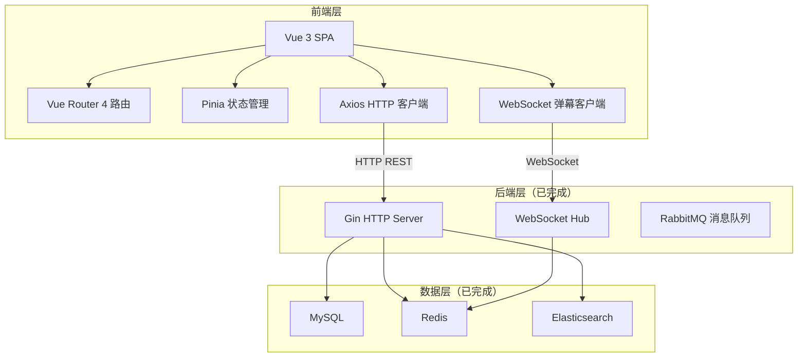
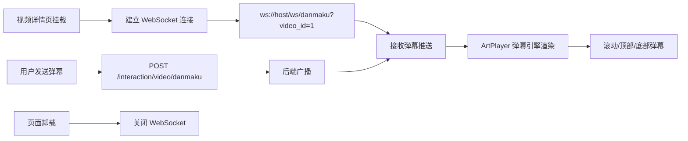

# 仿 B 站前端技术架构文档

> 基于 PRD 文档（`.trae/documents/prd.md`）和后端 API 文档（`server/docs/API.md`）设计。

---

## 1. 架构设计



---

## 2. 技术描述

| 层级 | 技术选型 | 版本 | 用途 |
|------|---------|------|------|
| 前端框架 | Vue 3 | 3.4+ | Composition API + `<script setup>` |
| 类型系统 | TypeScript | 5.3+ | 类型安全 |
| 构建工具 | Vite | 5.0+ | 开发服务器 + 生产构建 |
| 路由 | Vue Router | 4.2+ | SPA 路由管理 |
| 状态管理 | Pinia | 2.1+ | 全局状态（用户/通知/历史） |
| HTTP 客户端 | Axios | 1.6+ | API 请求 + 拦截器 |
| 样式方案 | Tailwind CSS | 3.4+ | 原子化 CSS + 自定义主题 |
| 图标库 | @iconify/vue | 4.1+ | 线性图标集合 |
| 视频播放器 | ArtPlayer | 5.1+ | 视频播放 + 自定义控制条 |
| 弹幕引擎 | ArtPlayerPluginDanmuku | 5.1+ | 弹幕渲染引擎 |
| 富文本编辑器 | @wangeditor/editor-for-vue | 5.1+ | 文章编辑 |
| 初始化工具 | create-vue | latest | Vite + Vue 3 项目脚手架 |

---

## 3. 项目目录结构

```
web/
├── public/                 # 静态资源
├── src/
│   ├── api/               # API 请求封装（按模块组织）
│   │   ├── request.ts     # Axios 实例 + 拦截器
│   │   ├── user.ts        # 用户相关 API
│   │   ├── video.ts       # 视频相关 API
│   │   ├── interaction.ts # 互动相关 API
│   │   ├── comment.ts     # 评论相关 API
│   │   ├── article.ts     # 文章相关 API
│   │   ├── coin.ts        # 投币相关 API
│   │   ├── favorite.ts    # 收藏夹相关 API
│   │   ├── follow.ts      # 关注相关 API
│   │   ├── notification.ts# 通知相关 API
│   │   ├── history.ts     # 历史记录相关 API
│   │   ├── dynamic.ts     # 动态相关 API
│   │   └── daily.ts       # 每日任务相关 API
│   ├── assets/            # 图片/字体等资源
│   ├── components/        # 通用组件
│   │   ├── layout/        # 布局组件（Navbar/Sidebar/Footer）
│   │   ├── video/         # 视频相关组件（VideoCard/Player/Danmaku）
│   │   ├── comment/       # 评论组件（CommentTree/CommentItem/Input）
│   │   ├── user/          # 用户组件（Avatar/UserCard/FollowBtn）
│   │   └── common/       # 通用组件（Pagination/Modal/Loading/Empty）
│   ├── composables/       # 组合式函数（useAuth/useVideo/useWebSocket）
│   ├── router/            # 路由配置
│   │   └── index.ts       # 路由表 + 守卫
│   ├── stores/            # Pinia 状态管理
│   │   ├── user.ts        # 用户状态（登录态/信息/token）
│   │   ├── notification.ts# 通知未读数
│   │   └── history.ts     # 搜索历史缓存
│   ├── types/             # TypeScript 类型定义
│   │   ├── api.ts         # API 响应类型
│   │   ├── user.ts        # 用户类型
│   │   ├── video.ts       # 视频类型
│   │   └── ...
│   ├── views/             # 页面组件
│   │   ├── HomeView.vue
│   │   ├── VideoDetailView.vue
│   │   ├── SearchView.vue
│   │   ├── UserHomeView.vue
│   │   ├── SpaceView.vue
│   │   ├── DynamicView.vue
│   │   ├── ArticleDetailView.vue
│   │   ├── UploadView.vue
│   │   └── LoginView.vue
│   ├── App.vue
│   ├── main.ts
│   └── style.css         # 全局样式 + Tailwind
├── index.html
├── package.json
├── tsconfig.json
├── tailwind.config.js
├── vite.config.ts
└── .env.development      # 开发环境变量
```

---

## 4. 路由定义

| 路由路径 | 页面名称 | 鉴权 | 说明 |
|---------|---------|------|------|
| `/` | 首页 | 公开 | 视频推荐流 + 分区导航 |
| `/video/:id` | 视频详情页 | 公开 | 播放器 + 弹幕 + 评论 + 互动 |
| `/search` | 搜索页 | 公开 | 搜索结果 + 搜索历史 |
| `/user/:id` | 用户主页 | 公开 | 用户信息 + 视频/动态列表 |
| `/space` | 个人中心 | 需登录 | 收藏夹/历史/通知/流水/任务 |
| `/space/favorites` | 我的收藏 | 需登录 | 收藏夹管理 |
| `/space/history` | 观看历史 | 需登录 | 视频/文章/搜索历史 |
| `/space/notifications` | 消息通知 | 需登录 | 通知列表 |
| `/space/coin-ledger` | 硬币流水 | 需登录 | 投币流水记录 |
| `/space/daily` | 每日任务 | 需登录 | 任务完成情况 + 等级 |
| `/dynamic` | 动态广场 | 需登录 | 关注用户动态流 |
| `/article/:id` | 文章详情 | 公开 | 文章内容 + 评论 |
| `/upload` | 投稿页 | 需登录 | 视频上传 + 文章发布 |
| `/login` | 登录/注册 | 公开 | 登录 + 注册 + 验证码 |

**路由守卫**：
- `beforeEach`：检查 `requiresAuth`，未登录跳转 `/login?redirect=原路径`
- `afterEach`：页面标题更新 + 滚动到顶部

---

## 5. API 定义

### 5.1 请求封装

Axios 实例配置：
- `baseURL`：从环境变量读取（开发环境 `http://localhost:8080/api`）
- `timeout`：10 秒
- 请求拦截器：自动添加 `Authorization` 头
- 响应拦截器：统一处理 `code !== 3` 业务错误、token 过期跳转登录

### 5.2 统一响应类型

```typescript
interface ApiResponse<T = any> {
  code: 3 | 4       // 3=成功, 4=失败
  data: T           // 业务数据
  msg: string       // 提示消息
}

interface PaginatedResp<T> {
  list: T[]
  total: number
  page: number
  page_size: number
}
```

### 5.3 API 模块清单

完整 API 定义见 `server/docs/API.md`，前端按模块封装：

| 模块 | API 文件 | 核心接口 |
|------|---------|---------|
| 用户 | `api/user.ts` | 登录/注册/个人信息/等级 |
| 视频 | `api/video.ts` | 列表/详情/草稿上传/转码状态 |
| 互动 | `api/interaction.ts` | 点赞/收藏/关注/弹幕 |
| 评论 | `api/comment.ts` | 列表/回复/点赞/删除 |
| 文章 | `api/article.ts` | 详情/草稿/发布 |
| 投币 | `api/coin.ts` | 视频投币/流水查询 |
| 收藏夹 | `api/favorite.ts` | 列表/创建/编辑/删除/移动 |
| 关注 | `api/follow.ts` | 粉丝列表/关注列表 |
| 通知 | `api/notification.ts` | 列表/未读数/已读/静默 |
| 历史 | `api/history.ts` | 观看/阅读/搜索历史 |
| 动态 | `api/dynamic.ts` | 发布/列表/Feed/点赞 |
| 每日任务 | `api/daily.ts` | 登录奖励/任务查询 |

---

## 6. WebSocket 弹幕架构



---

## 7. 状态管理

### 7.1 用户状态（useUserStore）

```typescript
interface UserState {
  token: string | null
  userInfo: Account | null
  isLogin: boolean
}

// actions: login / logout / fetchUserInfo / setToken
```

### 7.2 通知状态（useNotificationStore）

```typescript
interface NotificationState {
  unreadCount: number
}

// actions: fetchUnreadCount / incrementUnread / resetUnread
```

### 7.3 持久化

- `token` 持久化到 `localStorage`
- `userInfo` 持久化到 `localStorage`（刷新免重新请求）
- 搜索历史优先用后端 API，本地 `sessionStorage` 缓存作为 fallback

---

## 8. 构建与部署

### 8.1 开发环境

```bash
cd web
npm install
npm run dev          # 启动开发服务器（端口 5173）
```

环境变量 `.env.development`：
```
VITE_API_BASE_URL=http://localhost:8080/api
VITE_WS_URL=ws://localhost:8080/ws
```

### 8.2 生产构建

```bash
npm run build        # 输出到 dist/
npm run preview      # 本地预览生产构建
```

### 8.3 代理配置

`vite.config.ts` 配置开发环境代理，解决跨域：
```typescript
server: {
  proxy: {
    '/api': 'http://localhost:8080',
    '/ws': { target: 'http://localhost:8080', ws: true }
  }
}
```

---

## 9. 性能优化策略

- **路由懒加载**：所有页面组件 `() => import()` 按需加载
- **图片懒加载**：视频封面使用 Intersection Observer
- **虚拟滚动**：长列表（评论/历史）使用虚拟滚动
- **请求去重**：相同请求合并（Axios cancel token）
- **骨架屏**：数据加载时显示骨架屏占位
- **代码分割**：第三方库单独打包（vendor chunk）
